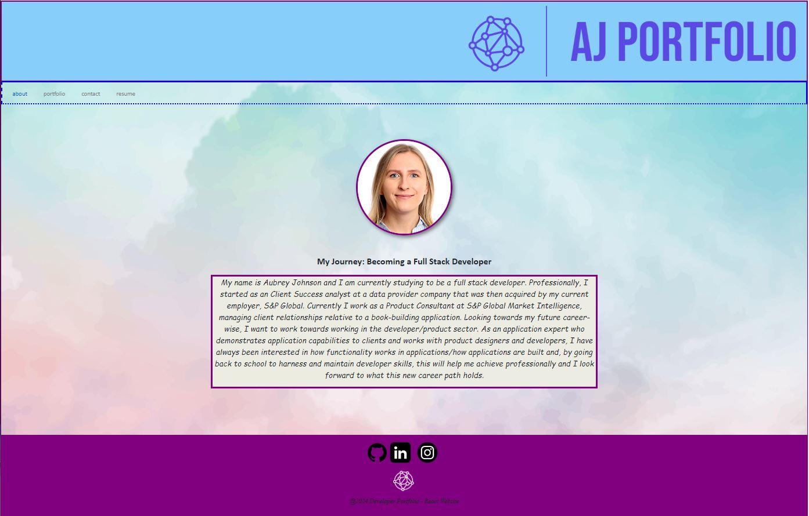

# React-Portfolio-2024

## Your Task

This project is presented in the form of an online portfolio using new React skills, in an effort to display my skills and projects as a developer. In a world full of developers, it is important to be apart of the community and to share work and collaborate on projects.


## User Story

```md
AS AN employer looking for candidates with experience building single-page applications
I WANT to view a potential employee's deployed React portfolio of work samples
SO THAT I can assess whether they're a good candidate for an open position
```

## Acceptance Criteria

```md
GIVEN a single-page application portfolio for a web developer
WHEN I load the portfolio
THEN I am presented with a page containing a header, a section for content, and a footer
WHEN I view the header
THEN I am presented with the developer's name and navigation with titles corresponding to different sections of the portfolio
WHEN I view the navigation titles
THEN I am presented with the titles About Me, Portfolio, Contact, and Resume, and the title corresponding to the current section is highlighted
WHEN I click on a navigation title
THEN the browser URL changes and I am presented with the corresponding section below the navigation and that title is highlighted
WHEN I load the portfolio the first time
THEN the About Me title and section are selected by default
WHEN I am presented with the About Me section
THEN I see a recent photo or avatar of the developer and a short bio about them
WHEN I am presented with the Portfolio section
THEN I see titled images of six of the developer’s applications with links to both the deployed applications and the corresponding GitHub repositories
WHEN I am presented with the Contact section
THEN I see a contact form with fields for a name, an email address, and a message
WHEN I move my cursor out of one of the form fields without entering text
THEN I receive a notification that this field is required
WHEN I enter text into the email address field
THEN I receive a notification if I have entered an invalid email address
WHEN I am presented with the Resume section
THEN I see a link to a downloadable resume and a list of the developer’s proficiencies
WHEN I view the footer
THEN I am presented with text or icon links to the developer’s GitHub and LinkedIn profiles, and their profile on a third platform (Stack Overflow, Twitter)
```

## Mock-Up

The following animation shows the web application's appearance and functionality:



## Installation

Packages (package.json) - Details on the installed technologies and the combined scripts. 

Vite (vite.config.js) - Sets the port for the application.

index.html - Initial layout for the structure of the application. Also imports the main.jsx and therefore the other components.

utils (emailValidation) - Ensures that the email is validated for format.

src (app.jsx/main.jsx/components) - Structure, page linking, and js code for the individual pages (about/portfolio/contact/resume), as well as the same for the nav bar, header/footer.

## Usage

To get the application up and running, you will need to use vite, install the required technologies and run the commands below as follows.

1. npm create vite@latest

2. npm install (react, react-dom, eslint technologies)

3. npm run dev

Please also see the link for the launched application below.

[link]()

## Credits

Alexis San Javier (Calendy Tutor) assisted with resolving errors in the jsx file, provided advice on the use of useState/formState/setFormState in contact file. 

Logos generated via [Adobe-Express-Online-Logo-Generator](https://express.adobe.com/express-apps/logo-maker)

Background image is from [Vecteezy](https://www.vecteezy.com/)

Social media icons are from the following:

[Instagram](https://www.vecteezy.com/png/23986521-instagram-logo-png-instagram-logo-transparent-png-instagram-icon-transparent-free-png)

[LinkedIn](https://www.vecteezy.com/)

[GitHub](https://www.flaticon.com/free-icon/github-logo_25231)

## License

MIT License

Copyright (c) 2023 aubreymlj96

Permission is hereby granted, free of charge, to any person obtaining a copy
of this software and associated documentation files (the "Software"), to deal
in the Software without restriction, including without limitation the rights
to use, copy, modify, merge, publish, distribute, sublicense, and/or sell
copies of the Software, and to permit persons to whom the Software is
furnished to do so, subject to the following conditions:

The above copyright notice and this permission notice shall be included in all
copies or substantial portions of the Software.

THE SOFTWARE IS PROVIDED "AS IS", WITHOUT WARRANTY OF ANY KIND, EXPRESS OR
IMPLIED, INCLUDING BUT NOT LIMITED TO THE WARRANTIES OF MERCHANTABILITY,
FITNESS FOR A PARTICULAR PURPOSE AND NONINFRINGEMENT. IN NO EVENT SHALL THE
AUTHORS OR COPYRIGHT HOLDERS BE LIABLE FOR ANY CLAIM, DAMAGES OR OTHER
LIABILITY, WHETHER IN AN ACTION OF CONTRACT, TORT OR OTHERWISE, ARISING FROM,
OUT OF OR IN CONNECTION WITH THE SOFTWARE OR THE USE OR OTHER DEALINGS IN THE
SOFTWARE.
